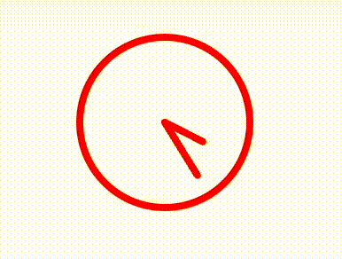

# Quantori Homework #3.2

### BEM, Graphics, Design

---

**Main Branch:** <a href="https://mordvintsevmv.github.io/quantori_homework_3_2" target="_blank">Open page</a>

**Description:** *The main branch of the app.*

---

**Clock Animation Branch:** <a href="https://quantori-hw3-2-feature-animation.netlify.app" target="_blank">Open page</a>

**Description:** *SVG clock animation.*

---

**Custom Clock Branch:** <a href="https://quantori-hw3-2-feature-custom.netlify.app" target="_blank">Open page</a>

**Description:** *CASIO MTA-1000 watch design using SVG and JS.*

---

## <a name="content">Content</a>

1. [Task](#Task)
2. [Branches](#branches)
3. [Contacts](#contacts)

---

## <a name="Task">Task</a>

- [ ] You need to add animation to the hands on the clock to get the following result:

---

## <a name="branches">Branches</a>

---

## <a name="contacts">Contacts</a>

**TG**: [@mordvintsevmv](https://t.me/mordvintsevmv)

**e-mail**: mordvintsevmv@gmail.com

[🔝Content🔝](#content)
